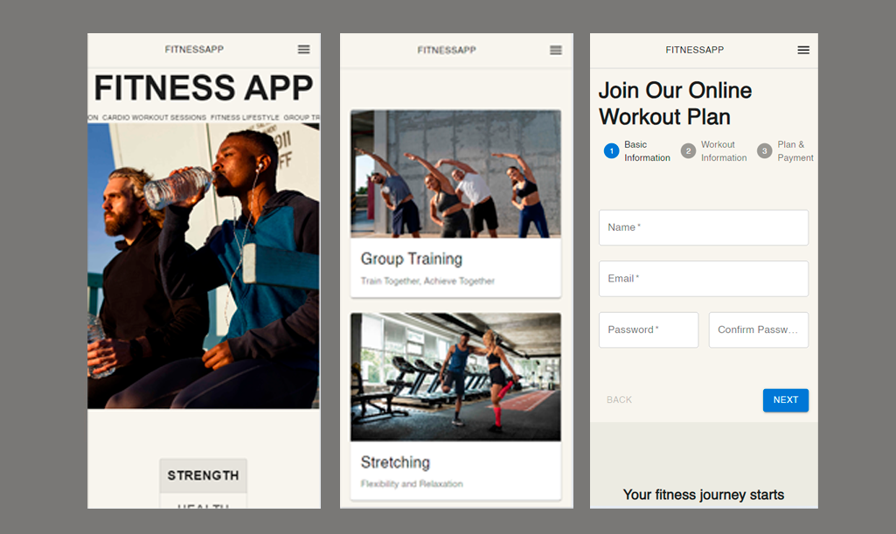
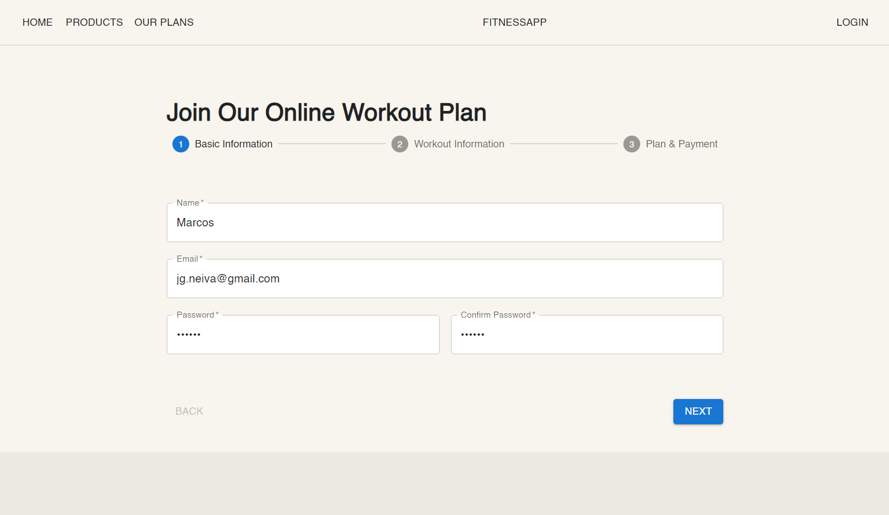
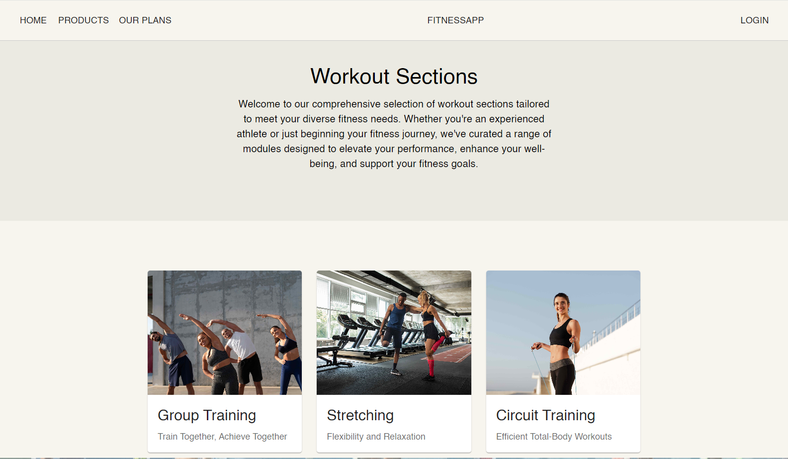
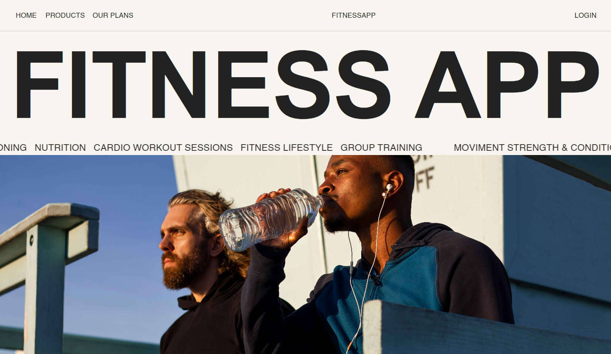
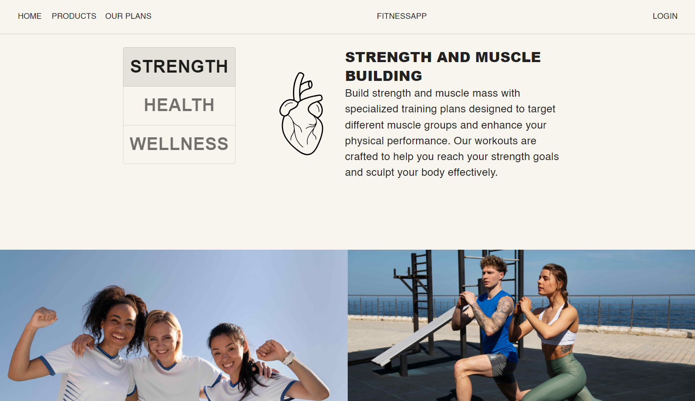
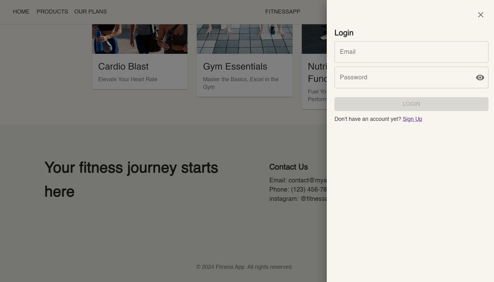
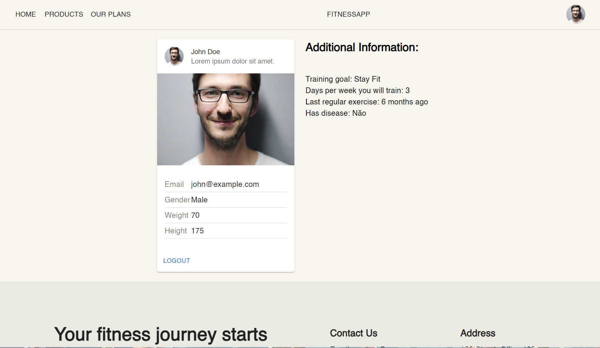

# [Fitness App](https://important-edge.surge.sh/)

<p align="center">
  
</p>

## About:
The "Fitness app" project is a responsive frontend application of a fictional platform offering personalized fitness content and guidance. It was built with React, Typescript and MUI library. Features include login, signup, product, home and profile pages.

## Functionalities:
- [x]   <strong>React and TypeScript:</strong> Used TypeScript to enhance type safety and React for building the app.
- [x]   <strong>MUI:</strong> All elements on the pages and componentes were built with Material UI design system's library.
- [x]  <strong>Validations:</strong> Implemented form validations including email format validation, password length validation, matching passwords, capitalizing card names, checking card expiration dates and valid months, and ensuring the presence of required form inputs.
- [x]  <strong>Login page:</strong> Created a login page that validates input data, authenticates users using mocked data, authorizes access, and redirects authenticated users to the profile page while storing their user ID in localStorage.
- [x]  <strong>Class and Methods:</strong> Used class and methods in authentication component, to handle authentication logic separately.
- [x]  <strong>Different Interfaces:</strong> Utilized different interfaces such as UserProfile and UserSecurity to handle distinct data structures and separate tasks related to sensitive data and profile information.


## Front-end deploy:
https://important-edge.surge.sh/

## How to run the front-end project:
The app's front-end is already deployed, but if you want to run the project in your machine, follow these steps:

```bash
# Clone the project's repository:
    git clone https://github.com/ojoaoneiva/fitnessApp.git

# Enter the front-end paste:
    cd ..
    cd frontend

# Install the app's dependencies:
    npm i

# Run the application:
    npm run start

# The server will start on localhost:3000
```


## Technologies used:
- Typescript
- React
- Design System (MUI)

## Images:

<p align="center">
  
  
    
    
    
    
    
</p>
